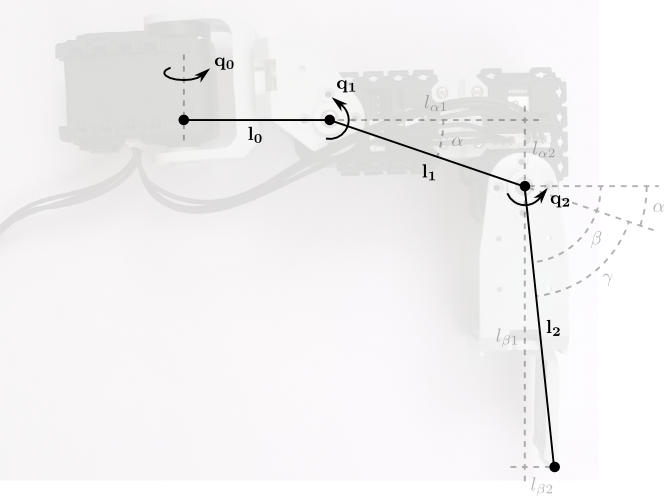

#HEXAPOD DOCUMENTATION

## Leg kinematics

The legs have been built following the instructions in the Robotis spider robot [manual][bioloid_spider_manual].

The structure is the following one.

[bioloid_spider_manual]: http://www.robotis.com/download/doc/ENG/BIO_PRM_KingSpider_ASM_EN.pdf