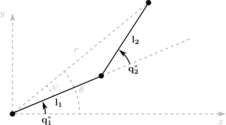

# Single leg kinematics

Each individual leg has been built following the instructions in the Robotis spider robot [manual][bioloid_spider_manual].

The structure of the leg can be seen in the following picture.

__TODO: insert nice picture of the leg here, maybe from the manual?__

In order to analyse its kinematics, it is useful to consider the last two joints, with parallel axes of rotation, to behave as a 2DOF planar robot. The following diagram shows its geometric parameters.

Instead of solving for this structure directly, let's compare it first with a general 2DOF planar robot geometry.

It is quite easy to note that if the kinematic model to the general 2DOF is found

$q_1^* = f( x, y )$

$q_2^* = g( x, y )$

the solution to the equivalent two joints in the specific spider robot geometry can be directly computed as

$q_1 = q_1^* + \alpha$

$q_2 = q_2^* + \gamma = q_2^* + \beta - \alpha$

## IK solution to planar 2DOF

The IK solution to the planar 2DOF can be deduced as follows, with $(x,y)$ being the coodinates of the robot tip.

Directly from the tip coordinates we can compute $r$ and $\theta$ with

$r^2 = x^2 + y^2$

$\theta = atan2( y, x )$

Then, using the law of the cosinus we can obtain $q_2^2$ with

$r^2 = l_1^2 + l_2^2 - 2 \, l_1 \, l_2 \, cos( \pi - q_2^*)$

$q_2^* = \pi - acos( \frac{ l_1^2 + l_2^2 - r^2 }{ 2 \, l_1 \, l_2 } )$

And knowing that

$q_1^* = \theta - \psi$

We can obtain $q_1^*$ using, again, the law of the cosinus

$l_2^2 = l_1^2 + r^2 - 2 \, l_1 \, r \, cos(\psi)$

$q_1^* = \theta - \psi = atan2( y, x ) - acos( \frac{ l_1^2 + r^2 - l_2^2 }{ 2 \, l_1 \, r } )$

The other solution to the IK, deducible by observation is

$q_1^* = \theta + \psi = atan2( y, x ) + acos( \frac{ l_1^2 + r^2 - l_2^2 }{ 2 \, l_1 \, r } )$

$q_2^* = - \pi + acos( \frac{ l_1^2 + l_2^2 - r^2 }{ 2 \, l_1 \, l_2 } )$

<!-- Links -->

[bioloid_spider_manual]: http://www.robotis.com/download/doc/ENG/BIO_PRM_KingSpider_ASM_EN.pdf