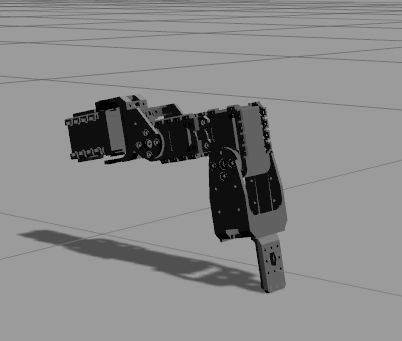

# hexapod_gazebo package

This package contains configuration files for running the hexapod robot in simulation, using gazebo.

Simulated robot can be started with

```bash
roslaunch hexapod_gazebo hexapod.launch
```

So far you will only find a model of a single leg, falling to the ground.

